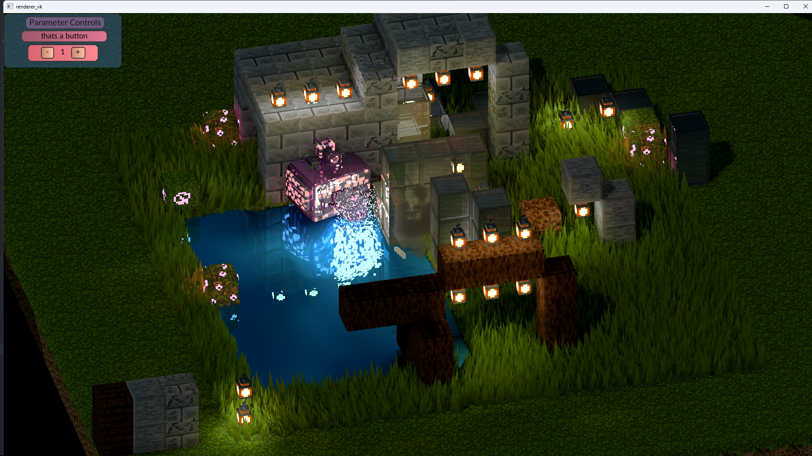

# Lum
**Lum** is a voxel engine I'm developing because none of the existing ones meet my needs. Currently, it's not available as a standalone project but is bundled with a demo instead

##### Screenshot

## Installation 
- ### Prerequisites
  - **MinGW64 C++ Compiler**: If you're on Windows, follow instructions at [MSYS2](https://www.msys2.org/)
    - other compilers support not tested
  - **Vcpkg**: follow instructions at [Vcpkg](https://vcpkg.io/en/getting-started)
  - **Vulkan SDK**: follow instructions at [LunarG](https://vulkan.lunarg.com/sdk/home)
    - Vulkan support is required. However, you might be able to use MoltenVK or other implementations
  - **GNU Make**: installed with MinGW64 as mingw32-make.exe (mingw32-make.exe is refered as make)
- ### Required Libraries
  - **[GLM](https://github.com/g-truc/glm)**: Install via MSYS2
  - **[GLFW](https://www.glfw.org/)**: Install via MSYS2
  - **[Volk](https://github.com/zeux/volk)**: Part of the Vulkan SDK
  - **[RmlUi](https://mikke89.github.io/RmlUiDoc/)**: Install via Vcpkg (for MinGW64 static triplet)
- ### Steps  
  - Install Prerequisites, make sure VULKAN_SDK and VCPKG_ROOT are set and Mingw is in the Path
  - Install RmlUi using Vcpkg:\
`$vcpkg install rmlui --triplet=x64-mingw-static --host-triplet=x64-mingw-static`
    - you may be able to use other triplets, but i didnt test it

  - Install GLM and GLFW using MSYS2: \
`$ pacman -S mingw-w64-x86_64-glm mingw-w64-x86_64-glfw`
    - if not using MSYS2, just make sure necessary libraries and headers are installed in any other way and visible to your compiler

  - Get the repository: \
`$ git clone https://github.com/platonvin/lum.git` for *unstable* version or [download code from releases](https://github.com/platonvin/lum/releases)     

  - Navigate to the project directory:\
`$ cd lum` 
  - Initialize:\
`$ make init`   
  - Build and run:\
`$ make release -j10`
    - during development, `$make clean` if something (-pipe) broke

Alternatively, you can [download](https://github.com/platonvin/lum/releases) pre-built version for windows

## Engine Overview

### Demo controls
- WASD for camera movement
- Arrows for robot movement
  - Enter for shooting particles
- 0 to remove block underneath
- 1-9 and F1-F5 to place matching blocks (btw world is saved to a file)
- "<" and ">" to rotate camera
- "Page Up" and "Page Down" to zoom in/out
- Esc to close demo
