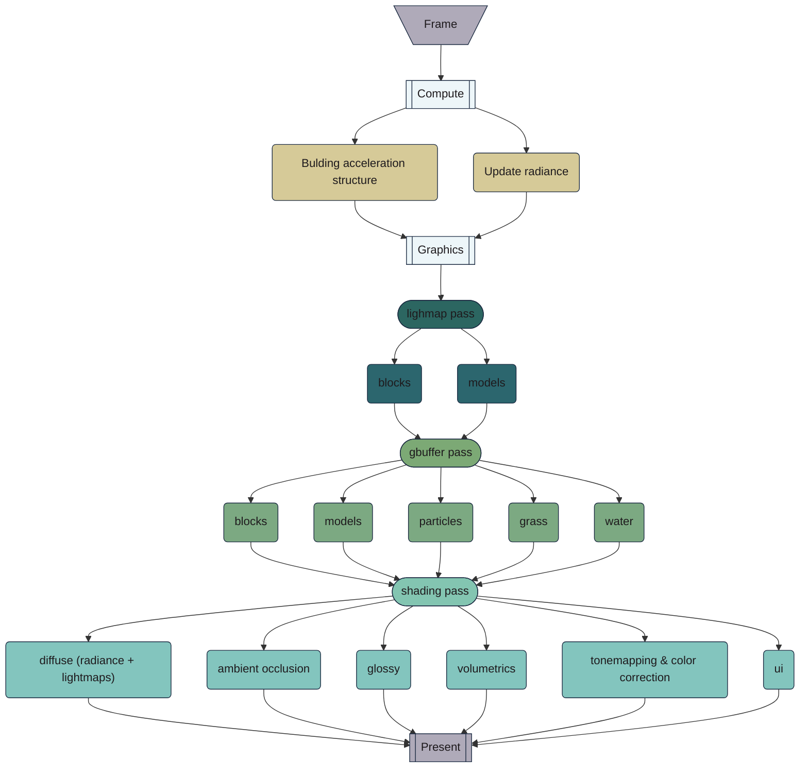

# Lum
**Lum** is a voxel renderer* I'm developing because none of the existing ones meet my needs. Currently, it's not available as a standalone project but is bundled with a demo instead 

\* technically, it also has input system, Ui and loader, but it is stil mostly GPU code 

##### Some demo footage
https://github.com/user-attachments/assets/ce7883c4-a706-406f-875c-fbf23d68020d

## Installation 
- ### Prerequisites
  - **C++ Compiler**: [MSYS2 MinGW](https://www.msys2.org/) recommended for Windows. For Linux prefer GNU C++
  - \[optional\] **Vcpkg**: follow instructions at [Vcpkg](https://vcpkg.io/en/getting-started). If no vcpkg found in PATH, it will be installed automatically
  - **Make**: for Linux, typically installed by default. For Windows, install manually (shipped with MinGW)
  - **Vulkan support**

- ### Steps  
  - make sure you have C++20 compiler and Make (and optionally Vcpkg). If you want to use non-default triplet (compiler) for Vcpkg, set VCPKG_DEFAULT_TRIPLET environment variable to desired triplet
  - get the repository: \
`$ git clone https://github.com/platonvin/lum.git` for *unstable* version or [download code from releases](https://github.com/platonvin/lum/releases)     
  - navigate to the project directory:\
 - `$ cd lum` 

 - `$ make`
    - on Linux, GLFW will ask you to install multiple different packages, but you can do it in advance:\
     `sudo apt install libxinerama-dev libxcursor-dev xorg-dev libglu1-mesa-dev pkg-config build-essential`

Alternatively, you can [download](https://github.com/platonvin/lum/releases) pre-built version for Windows

## Engine Overview

### Demo controls
- WASD for camera movement
- Arrows for robot movement
  - Enter for shooting particles
- 0 to remove block underneath
- 1-9 and F1-F5 to place matching blocks (btw world is saved to a file)
- "<" and ">" to rotate camera
- "Page Up" and "Page Down" to zoom in/out
- Esc to close demo
