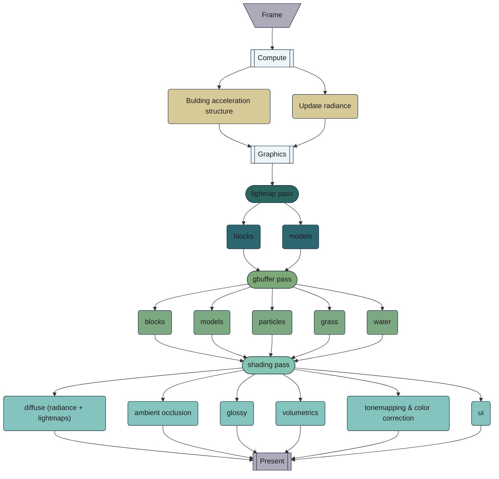

# Lum::Renderer 
`Lum::Renderer` is main Lum module - voxel rendering API. Supports both C99 and C++23 interfaces
## Overview 

The renderer is not intended to represent the entire game world; rather, it acts as a viewport, and you manage a limited section of your game world in Lum::Renderer world

## Building the Renderer 

To build the renderer, include the appropriate header file based on your programming language:
 
- **C++23 API** : is available in `src/renderer/api/renderer.hpp`. Compile it using: 
  - For a static library: `make build_unity_lib_static_cpp`
 
  - For a dynamic library: `make build_unity_lib_dynamic_cpp`
 
  - Or to build everything: `make`
 
- **C99 API** : can be found in `src/renderer/api/crenderer.h`. Compile it with: 
  - For a static library: `make build_unity_lib_static_c99`
 
  - For a dynamic library: `make build_unity_lib_dynamic_c99`
 
  - Or to build everything: `make`

Both APIs serve as wrappers around the internal API, which may not be as stable. For both API usage examples, go to the [examples directory](../examples/README.md).


## Usage 
0. **Settings**: define settings for the renderer
```cpp
    Lum::Settings settings = {};
        settings.world_size = ivec3(48, 48, 16); // world size in blocks
        settings.static_block_palette_size = 15; // how many blocks in your block palette. In demo.cpp case its 15
        settings.maxParticleCount = 8128; // particles are capped at this count. They are managed by CPU for now, so don't set it to high values
```

1. **Initialization** : Create an instance of `Renderer` init() it with desired settings. Attention - all foliage meshes have to be loaded before init()!

```cpp
Lum::Renderer renderer = Lum::Renderer();
// LOAD BEFORE INIT
// this is to keep resources init-time defined. Foliage is defined with custom shader
Lum::MeshFoliage foliage = renderer.loadFoliage("path/to/vertex_shader.glsl", vertices_per_foliage, density);
renderer.init(settings)
```
 
1.5. **Load world data** : semi-debug thing, you are supposed to set very block yourself using your own "chunk system" or something similar. Implemented for demo

```cpp
// not implemented.
renderer.loadWorld(world_data); //X->Y-Z 3d array of BlockID_t values
// or from file. If no file found, empty world is created instead
renderer.loadWorld("path/to/world/file");
```

2. **Set/get Blocks** : Manipulate individual blocks in the world by their coordinates (primary way of managing world)

```cpp
renderer.setWorldBlock(0, 0, 0, myBlock);
Lum::MeshBlock block = renderer.getWorldBlock(0, 0, 0);
```
 
3. **Loading meshes** : Import meshes to be rendered (models / liquids / volumetrics)

```cpp
Lum::MeshModel my_mesh = renderer.loadModel("path/to/mesh/magicavox_file.vox");
Lum::MeshLiquid water = renderer.loadLiquid(69, 42);
Lum::MeshVolumetric smoke = renderer.loadVolumetric(1, .5, {});
```
Mesh is handle for internal resource. It can and should be reused (copied) for objects with the same mesh (but not necessarily same transform)
While blocks and Models **are** voxels, foliage and liquid and volumetrics are not. Reason why they exist is they are all cheap (perfomance and designer time) unique ways to add details. And i also wanted to implement them \
Foliage meshes have to be loaded before init()

4. **Loading blocks** : from file / data

```cpp
BlockMesh dirt_block_id = 1; // start with 1, 0 is assumed air
renderer.loadBlock(dirt_block_id, "assets/dirt.vox");
BlockMesh grass_block_id = 2; // start with 1, 0 is assumed air
renderer.loadBlock(grass_block_id, "assets/grass.vox");
```
BlockMesh is little unique - its just int16 - id of a block in a palette

4.5. **Flushing data to gpu** :

```cpp
renderer.uploadBlockPaletteToGPU(); // sends block palette to gpu
// material is extracted from first model loaded
// it can be also explicetly extracted from model mesh file via 
render.loadPalette("assets/my_file_where_i_define_material_palette.vox")
renderer.uploadMaterialPaletteToGPU(); // sends material palette to gpu
```
do not forget to flush data every time its update (e.g. world changed a lot and some blocks will not be used anymore. You can load new blocks to old block id's (BlockMesh'es), remap old ones and flush data to GPU. Doing so might increase perfomance a little. Another example would be changing the palette - you might not have enough materials without such system)


5. **Rendering**: in your main loop

```cpp
renderer.startFrame();
renderer.drawWorld(); // draw blocks
renderer.drawParticles();

Lum::MeshTransform my_mesh_trans_instance_1; //setup yourself
renerer.drawModel(my_mesh, my_mesh_trans_instance_1);
Lum::MeshTransform my_mesh_trans_instance_2; //setup yourself
renerer.drawModel(my_mesh, my_mesh_trans_instance_2);

ivec3 pos; // in voxels, not blocks; relative to the lum:renderer world origin
lum.drawFoliageBlock(grass, pos);
lum.drawLiquidBlock(water, pos);
lum.drawVolumetricBlock(smoke, pos);

renderer.prepareFrame();
renderer.submitFrame();
```
 
6. **Cleanup** : Free any resources when done. Lum:Renderer stores internal resources in arena's, which means that it knows every allocated resource and can (will) destroy them automatically

```cpp
renderer.cleanup();
```

## Lum::Renderer frame overview
